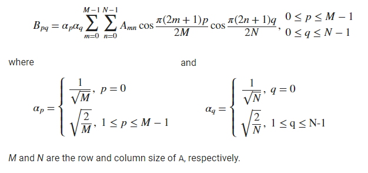
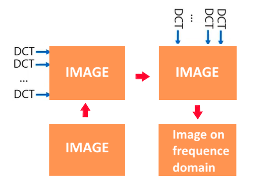
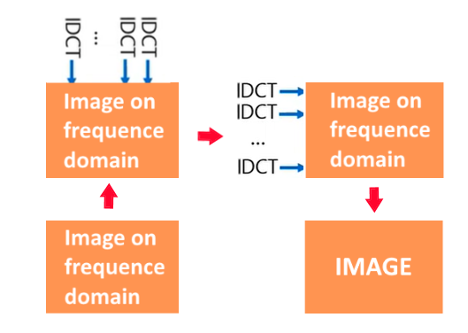
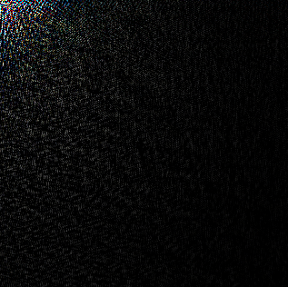

# DCT2D-Images
This project computes the two-dimensional discrete cosine transform (DCT2D) of an image an its inverse.
The DCT2D concept was present to me by Professor Leonardo Vidal Batista, from the Scientific Computer Departament (DCC) at Federal University of Paraiba, in the Digital Image Processing class.

## About DCT (Discrete Cosine Transform)
A <a href="https://en.wikipedia.org/wiki/Discrete_cosine_transform">discrete cosine transform (DCT)</a> expresses a finite sequence of data points in terms of a sum of cosine functions oscillating at different frequencies. 
It is used in most digital media, including digital images (such as JPEG and HEIF), digital video, digital audio, digital television and more.

     
    (Reference: https://www.mathworks.com/help/images/ref/dct2.html)

You can use a DCT1D implementation to create a 2d equivalent version. The DCT2D function allows the user to get the image a image from the color space domain and take it to the frequence domain. When you have a data in the frequence domain, a lot of mathematical function can be used to process the image, like the <a href="https://en.wikipedia.org/wiki/Butterworth_filter">low-pass butterwoth</a>, for example.

## DCT2D Separability Strategy
A way to make a DCT2D implementation using a DCT1D code that already exists is using separability strategy. The separability strategie consist in applying DCT1D on each row of the image. And then, make the same thing again, but using the columns instead of the rows.

     

DCT1D has an inverse mathematical operation, usually called as IDCT (Inverse DCT). By applying the inverse operation of DCT1D (Inverse DCT1D) on each column and then on each row of the image, you can return the image to the space domain and display it.

     

## Example of output

    
    
    
     (Original Image, Image on frequence domain (DCT2D), Image returned to the space domain (IDCT2D), respectively)

## Authors
 - [@Diego Reis](https://www.github.com/diegolrs)
